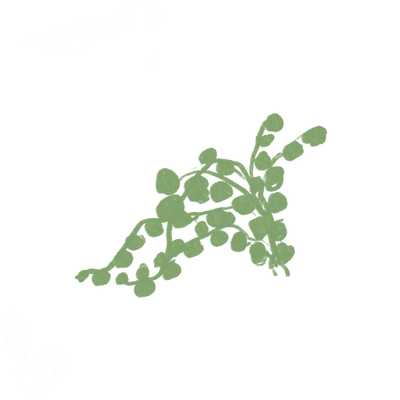

# 🌿 Virtual Terrarium

An interactive drag-and-drop terrarium built with pure HTML, CSS, and JavaScript — no libraries or frameworks. Arrange 14 plants inside a glass jar using pointer events and closures.



## ✨ Features

- Drag and drop 14 unique plant illustrations freely around the canvas
- Responsive navigation bar with Font Awesome icons
- CSS Grid layout with glass-morphism jar effect
- Accessible pointer events (mouse + touch support)
- Custom footer with social links

## 🛠 Tech Stack

- **HTML5** — semantic structure, nav, header, main, footer
- **CSS3** — absolute positioning, CSS Grid, border-radius glass effect
- **JavaScript** — closures, pointer events, DOM manipulation

## 📂 Project Structure

```
01-virtual-terrarium/
├── index.html      # Page structure and plant layout
├── style.css       # Jar, plant, nav, and layout styles
├── script.js       # Drag-and-drop logic using closures
└── images/         # 14 plant PNG illustrations
```

## ▶️ Running

Open `index.html` directly in any browser — no build step required.

## 🧠 Key Concepts Demonstrated

- **Closures** — each plant's drag handler closes over its own position state
- **Pointer Events API** — `onpointerdown`, `onpointermove`, `onpointerup`
- **CSS positioning** — `position: absolute` for free-form plant placement
- **DOM manipulation** — reading and updating `offsetTop`/`offsetLeft`

## 🔮 Future Improvements

- [ ] Save plant positions to localStorage so they persist on refresh
- [ ] Add a dark mode toggle
- [ ] Add plant name tooltips on hover
- [ ] Allow adding/removing plants dynamically

---

*Built as an introduction to HTML, CSS, and vanilla JavaScript DOM concepts.*
